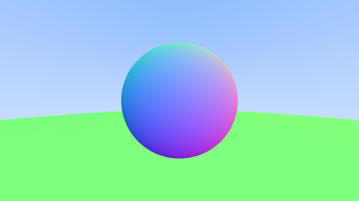

# Proyecto RT

Proyecto de 2024 para aprender conceptos básicos sobre la tecnología de renderización "Ray Tracing" (o "Path tracing" más adelante).

Se está siguiendo la serie de libros "Ray Tracing in one weekend", por lo tanto, ¡el crédito van a Peter Shirley, Trevor D Black, Steve Hollasch!

Hay que tener en cuenta que se programa sin ninguna otra librería... así que no usa la GPU... ya se hará otro proyecto para eso...

# RT Project

2024 project to learn basic concepts about “Ray Tracing” rendering technology (or “Path tracing” later on).

It is following the “Ray Tracing in one weekend” book series, so credit goes to Peter Shirley, Trevor D Black, Steve Hollasch!

Note that it is programmed without any other library... so it doesn't use the GPU... another project will be done for that...

# Imagenes / Images

||
|:--:|
|14/12/24 - Normales de dos esferas uno sobre el otro (poco a poco) :cry:|
|14/12/24 - 2 sphere normals, one on top of eachother (little by little) :cry:|

||
|:--:|
|15/12/24 - Imagen anterior con Antialiasing :sparkles:|
|15/12/24 - Previous image with Antialiasing :sparkles:|

# Referencias / references

- “Ray Tracing in one weekend” - Peter Shirley, Trevor D Black, Steve Hollasch - <https://raytracing.github.io/>
- Articulo de wikipedia sobre esferas - <https://es.wikipedia.org/wiki/Esfera>
